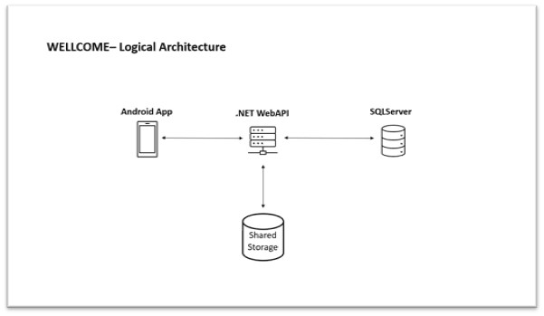
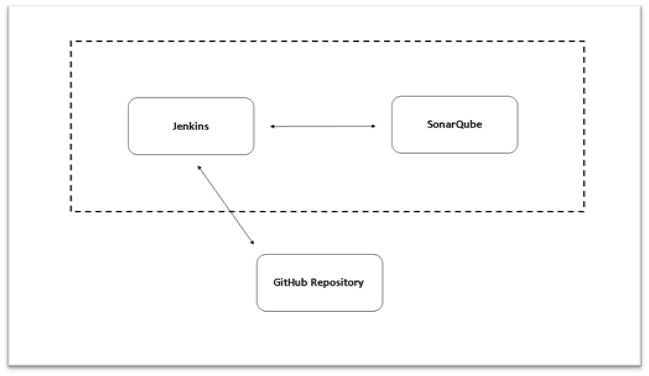
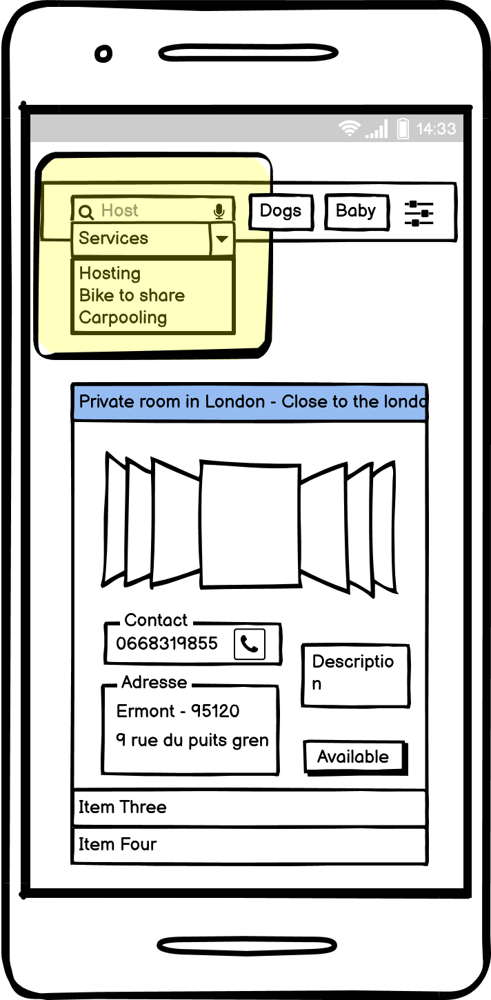
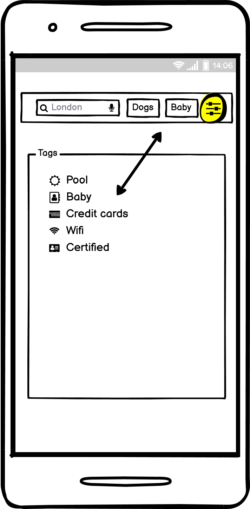
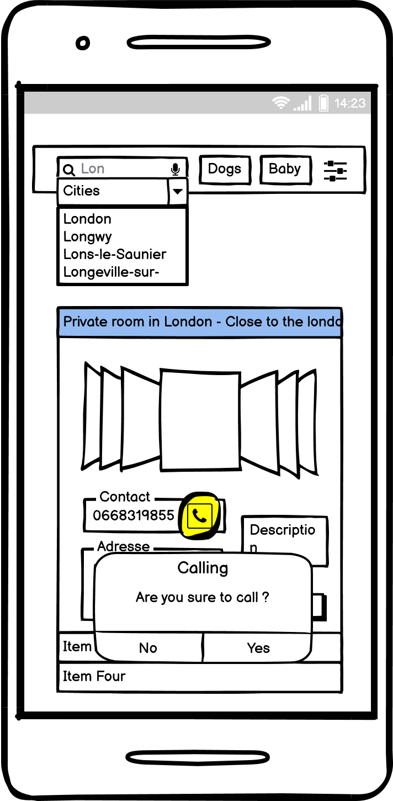
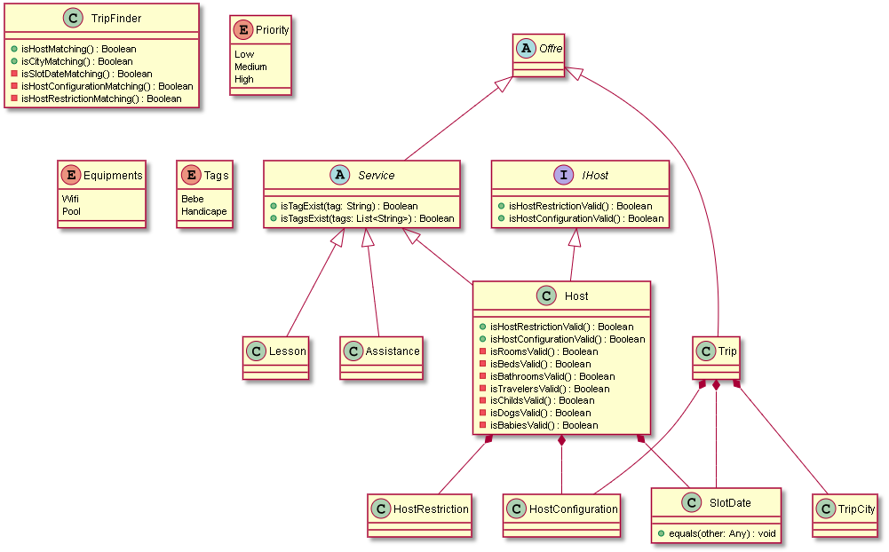

= Wellcome 

Welcome est une application mobile qui se base sur le principe de rencontre entre les 
particuliers afin d'êtres logés gratuitement.Elle servira aussi à proposer des services comme 
prendre des cours de piano, ou inversement a déposé une annonce en fonction de nos besoins. 
Les utilisateurs devront se connecter via un compte Wellcome. 
L’objectif est de faire profiter aux utilisateurs un moyen simple et efficace de découvrir le 
monde, prendre des cours etc... Sans avoir à dépensé d’argent. Actuellement si un particulier 
souhaite héberger gratuitement une personne il n’existe pas de plateforme permettant de 
déposer une annonce. Il en va de même pour les cours ou divers services que l’application va 
proposer. Notre différentiation vis à vis des autres plateforme déja existante va se faire grâce à 
la qualité et pertinance des services et hébergement que l’on va trouver.

== Introduction

*Title* : Wellcome 

*Team* : Amadou KEITA, Jialei SUN, Rayhane JEBBARI, Ahmed Bennali

*Marketing plan* : Publication sur les réseaux sociaux. Développement d’un site web afin 
d’avoir une plus grande visibilité. Enquête de satisfaction sur l’application mobile après chaque 
utilisation concrète de celle-ci.

== Tools 
* Application mobile Android dévelopée avec Kotlin
** Framework de test Android App : JUnit 

* Un Rest Server .NET WebAPI
** Framework de test RestServer : MSTest

* SqlServer
* GitHub Action
* SonarCloud 
* ML.NET  

== Logical Architecture 

== CI 

== Features
[square]
* Search services
* Phone Call from App
* Use tags to search services

== Search services

User is now able to search services with search bar provided. 3 Types of services are available : Hosts, Lesson, Assistance [Reworked]

 

== Tags

User is now able to filter services with tags provided by the App [Reworked]

 

== Offers 

Improve offers visualisations 

== Offers details

User is now able to visualize the details regarding the services : Host, Lesson, Assistance inside a page that appear after clicking on the current service.

 

== Architecture

